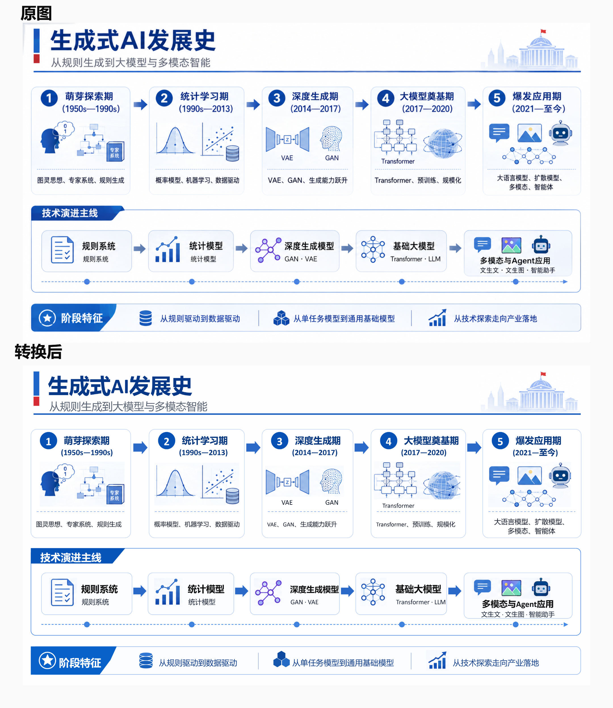
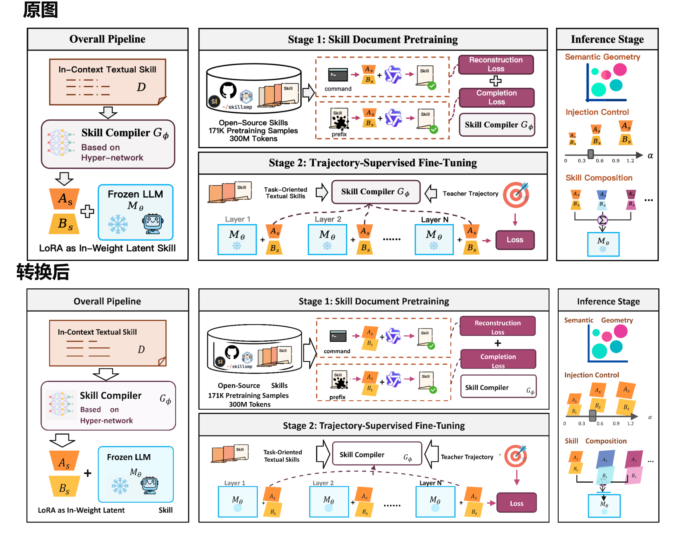
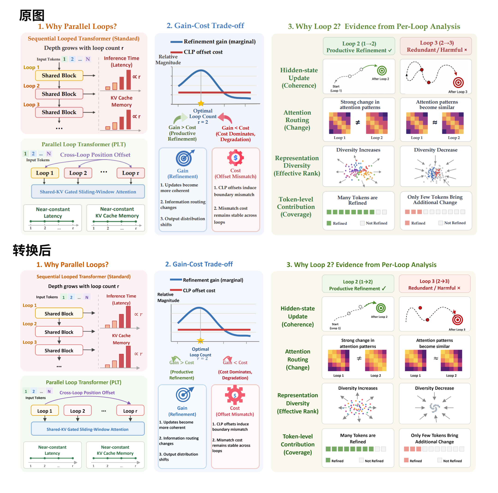
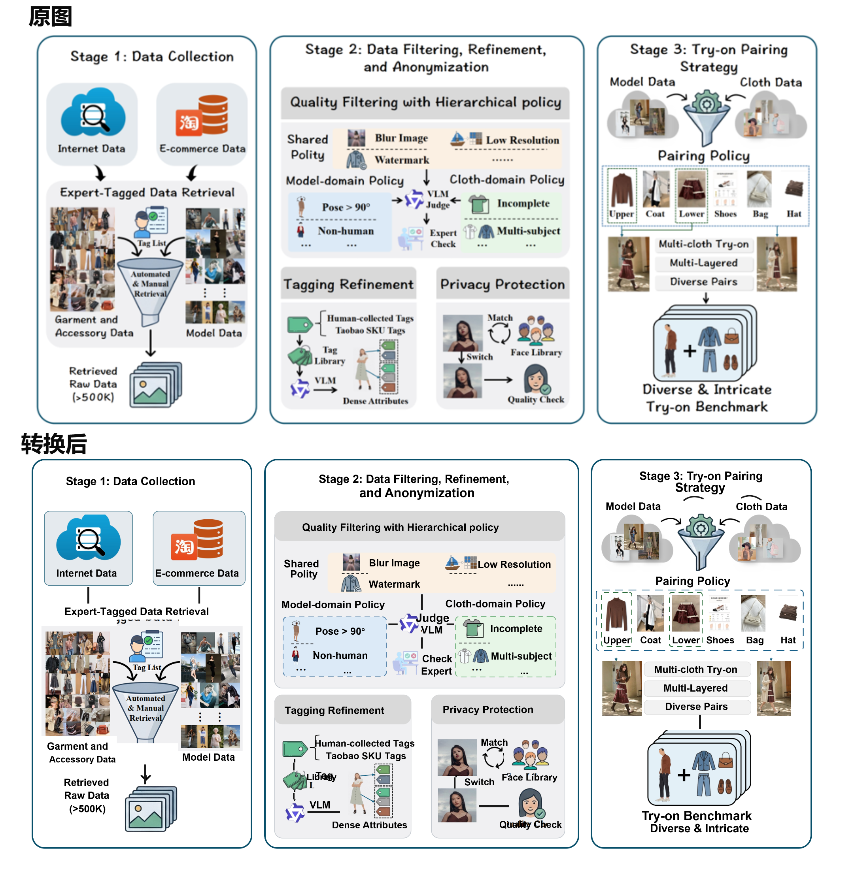
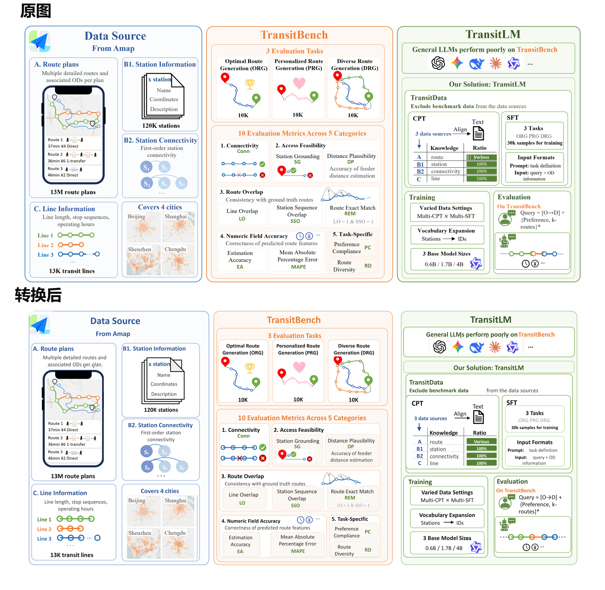
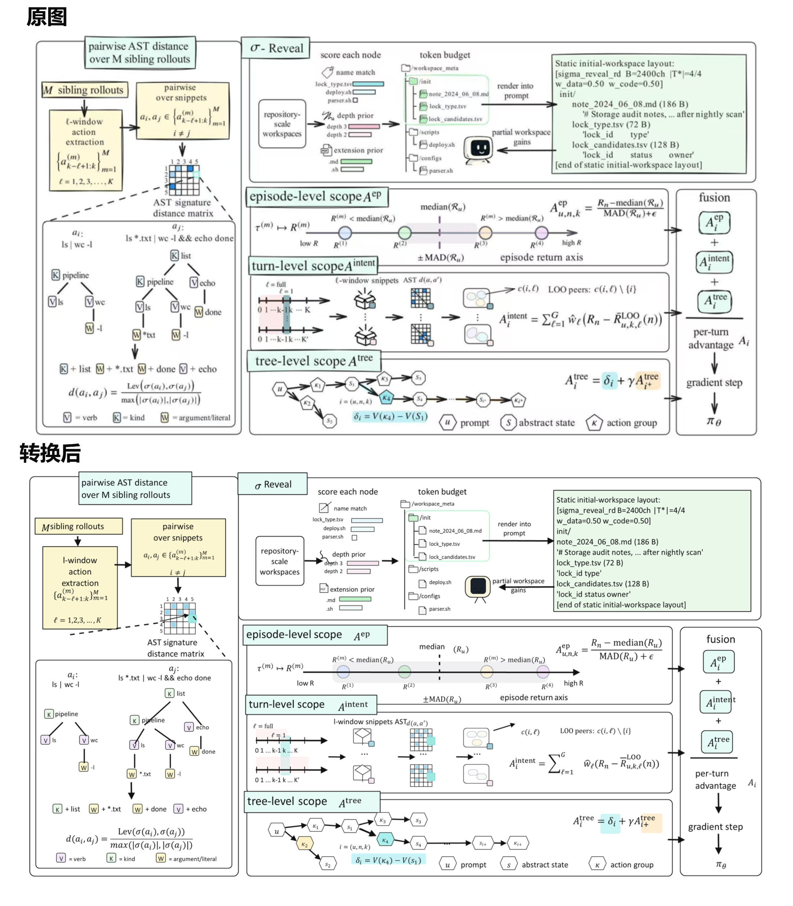

<div align="center">
  

  <h1>FigEdit · 图易编</h1>

  <p><strong>让压平的图，重新可编辑。</strong></p>

  <p>把截图、论文配图、流程图和 AI 生成图片重建为可编辑 SVG 与原生 PowerPoint。</p>

  <p>
    <a href="./README.md">中文</a> ·
    <a href="./README.en.md">English</a>
  </p>

  <p>
    
    
    
    
    <a href="./LICENSE"></a>
  </p>

  <p>
    <a href="#效果案例">效果案例</a> ·
    <a href="#快速开始">快速开始</a> ·
    <a href="#工作原理">工作原理</a> ·
    <a href="#致谢与第三方代码">致谢</a>
  </p>
</div>

---

## 这是什么

FigEdit（中文名「图易编」）是一个 AI Agent Skill。给它一张截图、论文配图、AI 生成的幻灯片、技术架构图、或者任何图片格式的图形，它会把图片拆解重建成可编辑的矢量图形包——文字变成真正的文字，形状变成矢量形状，公式变成可编辑的方程，图标和照片作为可替换的图片资产保留。

## 应用场景

**AI 生成的图片不能编辑？** — GPT Image 2、Nano Banana生成的幻灯片、架构图画面惊艳，但全是像素。FigEdit 把布局提取成真正的 PowerPoint 元素，文本框能编辑、形状能移动、背景能替换。

**看到好看的论文图想复刻？** — 想复刻优质图示的图框、形状、布局、配色。FigEdit 把图重建成可编辑结构，30 秒改完标签、替换元素，不用从头画一小时。

**图片原始可编辑版本丢失？** — 设计师交付的精美信息图，可编辑源文件丢了或从未共享。FigEdit拆成可编辑的SVG，框架变矢量，图标保留为干净的裁切图，文字变成可选中的文本。

## 效果案例

下面均为原图与 FigEdit 重建结果的对比。

### 案例一：PPT 结构拆解



[查看并下载完整案例：原图、SVG、PPTX、Manifest 与质量报告](./assets/examples/genai-history/)

### 案例二：图标与结构混合图



[查看并下载完整案例：原图、SVG、PPTX、Manifest 与质量报告](./assets/examples/skill-compiler/)

### 案例三：全矢量重绘



[查看并下载完整案例：原图、SVG、PPTX、Manifest 与质量报告](./assets/examples/parallel-loops/)

### 案例四：大量图片资产裁切



[查看并下载完整案例：原图、SVG、PPTX、Manifest 与质量报告](./assets/examples/tryon-pipeline/)

### 案例五：多要素混合重构



[查看并下载完整案例：原图、SVG、PPTX、Manifest 与质量报告](./assets/examples/transitlm/)

### 案例六：复杂公式复现



[查看并下载完整案例：原图、SVG、PPTX、Manifest 与质量报告](./assets/examples/ast-reveal/)

### 案例七：公式与图片资产混合重建


[查看并下载完整案例：原图、SVG、PPTX、Manifest 与质量报告](./assets/examples/camera-grid-rendering/)

## 为什么用它？

把一张扁平图片变回可编辑文件，难点不只是识别画面里有什么，而是判断每个元素应该以什么形式保留，现有方案各有各的问题：

| 方案类型             | 代表方案                                                     | 核心做法                                                     | 主要优势                         | 主要不足                                                         |
| ---------------- | -------------------------------------------------------- | -------------------------------------------------------- | ---------------------------- | ------------------------------------------------------------ |
| 轮廓拟合式矢量化         | Potrace、VTracer、Illustrator Image Trace                  | 根据像素颜色和边界拟合贝塞尔曲线，将整张图片转换为矢量路径                            | 速度快、成本低，适合 Logo、线稿、剪影和扁平图标   | 不理解文字、公式和元素关系；复杂图片容易产生大量碎片路径，虽然“全是矢量”，但实际很难编辑                |
| OCR 文本覆盖         | OCR 转 PPT、部分图片转幻灯片工具                                     | 保留原图或分块图片，在对应位置覆盖可编辑文本框                                  | 实现简单、视觉还原度较高，文字可以直接修改        | 图形和结构仍是位图；原文字可能残留在背景中，移动文本后容易露馅，只能算局部可编辑                     |
| 视觉理解与代码重建        | DrawIO、Excalidraw、TikZ、AutoFigure-Edit、Draw with Thought | 由多模态大模型理解图片，再生成 SVG、DrawIO、Excalidraw 或 TikZ 等结构代码       | 文字、节点、箭头和连接关系可编辑，适合规则流程图和架构图 | 代码表达能力偏向规则图形；自定义图标、Logo、照片、地图和截图容易被简化、遗漏或替换                  |
| 端到端 Image-to-SVG | StarVector、VFig、dots.mocr-svg、RLRF                       | 使用专门训练的模型，直接从图片生成完整 SVG 代码或矢量图元序列                        | 自动化程度高，可以输出路径级矢量对象           | 通常需要专用模型和 GPU；复杂图片会生成很长的 SVG，照片、纹理和专有视觉元素容易失真，模型泛化能力也受训练数据限制 |
| 元素分解与结构化组装       | Edit-Banana、CraftEditor                                  | 先通过sam分割、OCR、生成式清理等方法拆出文字和视觉元素，再组装成 DrawIO、SVG、PSD 等分层格式 | 能保留较丰富的视觉元素，也支持对象级移动、替换和重新组合 | 工作流太重，通常依赖多个模型、外部服务或 GPU 环境；对复杂图形还原能力不足                      |

FigEdit 采用混合重建策略：

- 文字、标题、普通标注重建为可编辑文本；
- 公式识别为独立的语义对象，并在原生 PPTX 中导出为可编辑的 Office Math 公式
- 面板、形状、边框、箭头和连接关系重建为矢量对象；
- Logo、照片、截图、地图、复杂图标等来源特异的视觉内容，直接从原图裁切保留；
- 最终同时输出 SVG、内嵌资产 SVG 和原生可编辑 PPTX。

装好依赖后，把图片交给 Agent，一句话即可完成分析、拆解、重建、导出和质量检查。

## 工作原理

<!-- TODO: 插入架构图 -->

整个流水线分四步：测量 → 决策 → 组装 → 验证。

### 测量

用 PaddleOCR 识别图中的文字位置和内容，用 OpenCV 检测线段、矩形、箭头等几何结构，同时采样配色和字体信息。最后产出原始测量数据，供下一步Agent决策使用。

### 决策

模型拿到测量数据后，对图做整体分类，然后逐个元素判断处理方式：

| 元素类型             | 处理方式                         |
| ---------------- | ---------------------------- |
| 面板、箭头、网格、分隔线     | 重绘为可编辑 SVG 形状                |
| 标签、标题、图注、图例      | 重打为可编辑文本                     |
| 方程、变量、行内公式       | 重建为 LaTeX，导出为可编辑 Office Math |
| 图标、照片、地图、图表、Logo | 从原图裁切，保留为可替换图片资产             |

对于复杂图，模型还会选择重建策略：简单图全矢量，混合图走混合重建，多面板图逐面板拆解，手绘图走语义近似。策略可以组合。

所有决策写入 `manifest.json`，整个过程可复现。

### 组装

根据 manifest 生成最终输出：矢量结构、可编辑文本、渲染后的公式、定位好的图片资产，一起打包成 SVG 和原生 PowerPoint 文件。

### 验证

自动检查输出质量：有没有面板漏掉、文字被意外困在图片里、公式转换是否成功、结构是否完整。发现问题会自动修复后重新组装。

## 快速开始

### 环境要求

- Python 3.10+
- 一个支持 skill 的 AI Agent 环境

FigEdit 的重建质量高度依赖模型视觉理解与SVG绘制能力，不同模型表现差异极大，优先推荐Codex、Claude Code。

| Agent 环境        | 推荐模型                               | 说明                                                                               |
| --------------- | ---------------------------------- | -------------------------------------------------------------------------------- |
| **Codex**       | GPT-5.5                            | 优先推荐，视觉理解、空间推理与工具调用能力较强                                                          |
| **Claude Code** | Claude Fable 5（次选Claude Opus 4.8）  | Claude Fable 5 ≥ GPT-5.5，可惜暂时下架了，Claude Opus 4.8亦可用，但复杂图转换效果不及GPT-5.5            |
| **其他主流 Agent**  | GPT-5.5、Claude Opus 4.8、Gemini 3.5 | 不建议使用仅擅长代码、但缺少图片输入或空间视觉推理能力的模型。即使能够执行 FigEdit 脚本，也容易在元素分类、裁切边界、层级关系和布局判断上出现明显偏差。 |

### 安装

**方式一：手动安装。** 克隆到 skill 目录，装好依赖：

```bash
# 克隆仓库
git clone https://github.com/giszzt/zzt-skill.git

# 将 figedit 目录复制到你的 skill 目录，然后安装依赖
pip install -r zzt-skill/figedit/requirements.txt
```

**方式二：让 Agent 帮你装。** 把项目地址发给你的 Agent，说一句：

```
请帮我安装配置好这个仓库里的 figedit skill：
https://github.com/giszzt/zzt-skill/tree/main/figedit
```

### 使用

装好之后，在 Agent 里对任意图片说一句话就行，不用记命令：

```
把这张图转成可编辑的 SVG 包。
```

```
把这张图转成可编辑的形式。
```

```
请将这张图矢量化，精准还原其中的内容。
```

```
这张图我想改几个字，帮我转成能编辑的 PPT。
```

模型会跑完整个流水线，把输出包交付到你的项目目录。

## 输出包

```
output/
├── editable.svg              # 可编辑 SVG，外链资产
├── editable_embedded.svg     # 自包含 SVG，资产 base64 内嵌
├── editable.pptx             # 原生 PowerPoint，真实文本框与形状
├── preview.png               # 预览图
├── contact_sheet.png         # 所有裁切资产一览
├── manifest.json             # 完整重建计划
├── quality_report.md         # 质量检查报告
├── editability_report.md     # 文本提取率与资产文本风险
└── assets/                   # 裁切的栅格资产
```

## 项目结构

```
figedit/
├── SKILL.md            # Skill 入口，完整工作流参考
├── README.md
├── LICENSE
├── THIRD_PARTY_NOTICES.md
├── requirements.txt
├── scripts/            # 测量、组装、PPTX 导出、审计等脚本
├── references/         # 决策参考文档（分类、决策矩阵、SVG 规范、公式等）
├── templates/          # Manifest schema 与模板
├── examples/           # 示例提示词
└── assets/examples/    # 可下载的完整重建案例
```

## 依赖

| 包             | 版本     | 用途             |
| ------------- | ------ | -------------- |
| opencv-python | ≥ 4.9  | 结构检测           |
| paddleocr     | ≥ 3.7  | 文字检测（PP-OCRv6） |
| paddlepaddle  | ≥ 3.3  | PaddleOCR 后端   |
| Pillow        | ≥ 10.0 | 图像处理           |
| numpy         | ≥ 1.24 | 数组运算           |
| scipy         | ≥ 1.10 | 空间分析           |
| matplotlib    | ≥ 3.7  | 预览渲染           |
| latex2mathml  | ≥ 3.81 | 公式转换           |
| lxml          | ≥ 5.0  | SVG/XML 处理     |

## 贡献

欢迎提交 issue 或改进建议，尤其是复杂版式、公式导出、OCR 校对和 PowerPoint 兼容性方面的问题。

## 致谢与第三方代码

FigEdit 的原生 SVG → PPTX 导出层基于 [PPT Master](https://github.com/hugohe3/ppt-master) 改编。感谢 Hugo He 开源这一套将 SVG 转换为原生、逐元素可编辑 PowerPoint 的实现。FigEdit 在此基础上加入了单图重建工作流、Manifest 资产组织、可编辑公式和质量检查等适配。

PPT Master 使用 MIT 许可证。上游版权声明、完整许可文本和改动说明见 [THIRD_PARTY_NOTICES.md](./THIRD_PARTY_NOTICES.md)。FigEdit 是独立项目，与 PPT Master 及其作者不存在隶属或背书关系。

## 许可证

FigEdit 自有代码使用 [MIT](LICENSE) 许可证；第三方代码沿用各自许可证，详见 [THIRD_PARTY_NOTICES.md](./THIRD_PARTY_NOTICES.md)。
