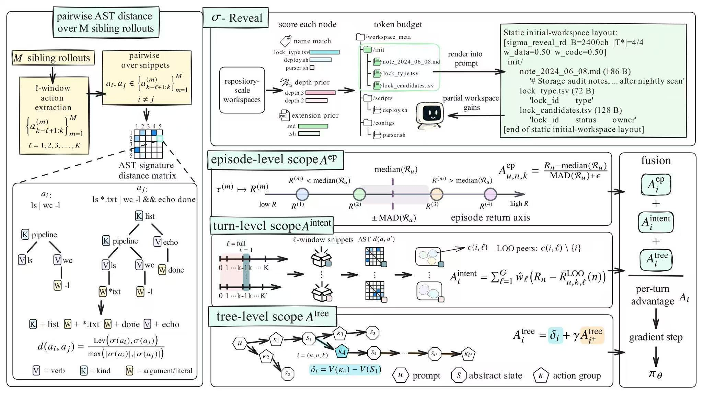
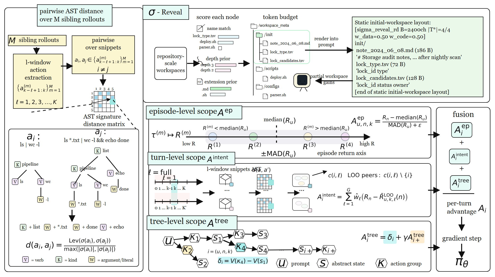

# AST Reveal

这个案例是一张公式密集型论文方法图。FigEdit 重建了多层面板、流程关系、树结构和数学表达式，并将 50 个公式导出为可编辑的 PowerPoint Office Math 对象。

This is a formula-heavy paper figure. FigEdit reconstructs its panels, process relationships, tree structures, and mathematical notation, including 50 editable Office Math equations in PowerPoint.

## Original / 原图

## Reconstructed preview / 重建预览

## Files / 文件

- [Editable SVG](./editable.svg)
- [Self-contained SVG / 内嵌资产 SVG](./editable_embedded.svg)
- [Native PowerPoint / 原生 PPTX](./editable.pptx)
- [Reconstruction manifest](./manifest.json)
- [Quality report](./quality_report.md)
- [Editability report](./editability_report.md)

The reconstruction contains 106 editable text elements, 234 structural vector elements, and 50 editable equations.
