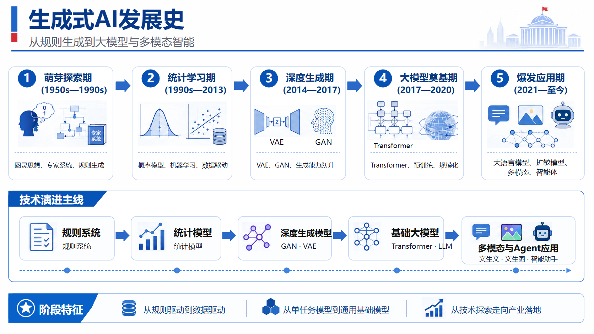

# Generative AI History / 生成式 AI 发展史

这个案例展示了 FigEdit 对信息图和 PPT 式版面的混合重建：卡片、标题、文字、箭头和时间线保持可编辑，具有来源特征的插图保留为可替换图片资产。

This case demonstrates a mixed reconstruction of an infographic-style slide. Cards, labels, arrows, and timelines are editable, while distinctive illustrations remain replaceable raster assets.

## Original / 原图

## Reconstructed preview / 重建预览

## Files / 文件

- [Editable SVG](./editable.svg)
- [Self-contained SVG / 内嵌资产 SVG](./editable_embedded.svg)
- [Native PowerPoint / 原生 PPTX](./editable.pptx)
- [Reconstruction manifest](./manifest.json)
- [Quality report](./quality_report.md)
- [Editability report](./editability_report.md)

The reconstruction contains 41 editable text elements, 53 structural vector elements, and 12 source-preserved assets.
