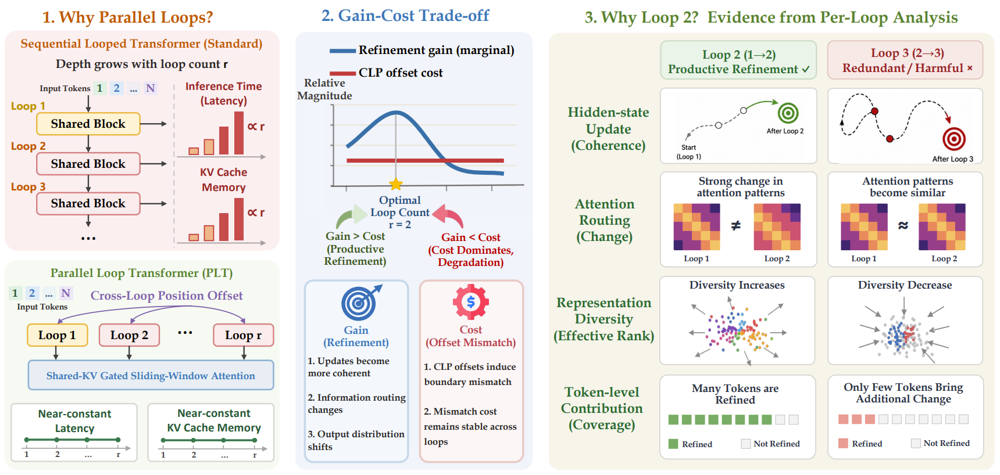
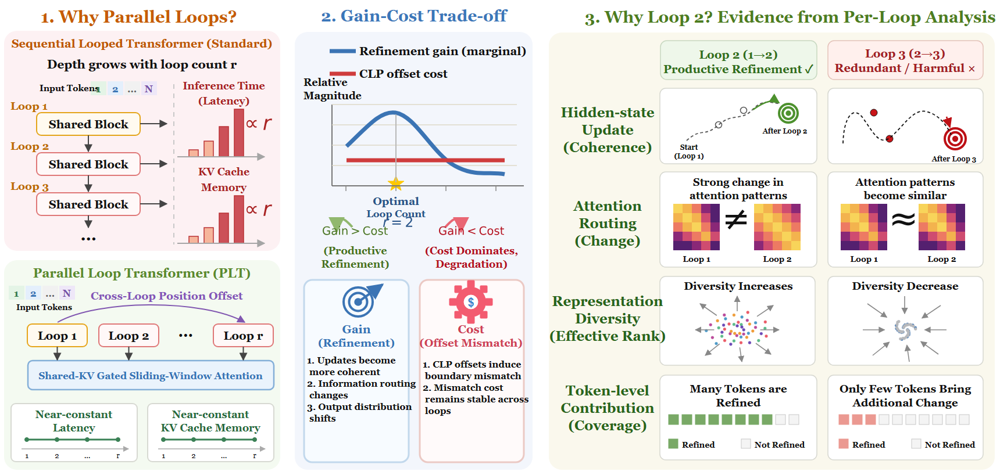

# Parallel Loops

这个案例展示了完整矢量重绘。原图中的面板、曲线、热力图、节点、连接线和普通文字均被重建为可编辑对象，没有使用栅格插图资产。

This case is a full vector redraw. Panels, curves, heatmaps, nodes, connectors, and labels are reconstructed as editable objects without raster illustration assets.

## Original / 原图

## Reconstructed preview / 重建预览

## Files / 文件

- [Editable SVG](./editable.svg)
- [Self-contained SVG / 内嵌资产 SVG](./editable_embedded.svg)
- [Native PowerPoint / 原生 PPTX](./editable.pptx)
- [Reconstruction manifest](./manifest.json)
- [Quality report](./quality_report.md)
- [Editability report](./editability_report.md)

The reconstruction contains 82 editable text elements, 344 structural vector elements, and 7 editable equations.
