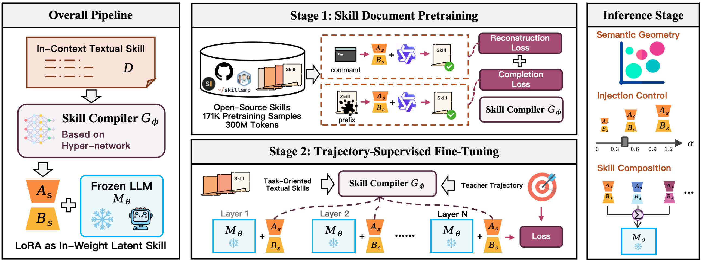
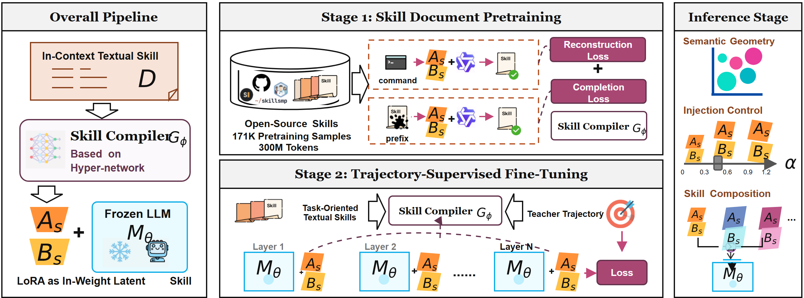

# Skill Compiler Pipeline

这个案例展示了图标、公式、结构化面板和流程关系并存时的混合重建。普通文字、框架、箭头和公式保持可编辑，模型标识与来源特异图形保留为可替换图片资产。

This case demonstrates a mixed reconstruction containing icons, formulas, structured panels, and process relationships. Labels, frames, connectors, and equations are editable, while model marks and source-specific graphics remain replaceable image assets.

## Original / 原图

## Reconstructed preview / 重建预览

## Files / 文件

- [Editable SVG](./editable.svg)
- [Self-contained SVG / 内嵌资产 SVG](./editable_embedded.svg)
- [Native PowerPoint / 原生 PPTX](./editable.pptx)
- [Reconstruction manifest](./manifest.json)
- [Quality report](./quality_report.md)
- [Editability report](./editability_report.md)

The reconstruction contains 48 editable text elements, 96 structural vector elements, 34 editable equations, and 12 source-preserved assets.
