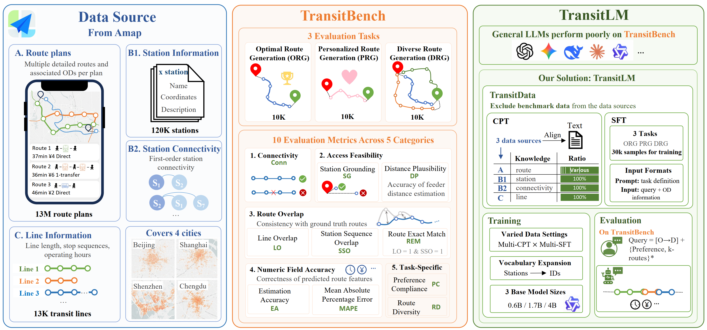
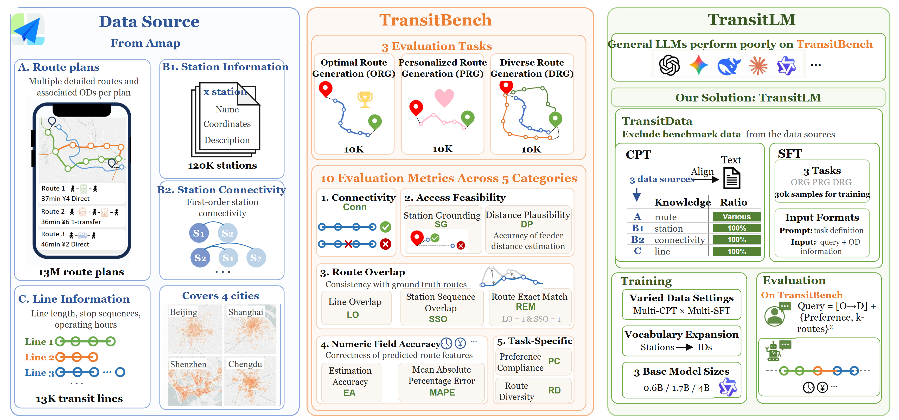

# TransitLM and TransitBench

这个案例展示了地图、手机界面、路线图、模型标识、指标卡和大量文本共同出现时的多要素混合重建。规则版面和普通文字保持可编辑，地图与来源特异图形作为图片资产保留。

This case demonstrates a mixed reconstruction containing maps, a phone interface, route graphics, model marks, metric cards, and dense text. Regular layout and labels are editable, while maps and source-specific visuals remain raster assets.

## Original / 原图

## Reconstructed preview / 重建预览

## Files / 文件

- [Editable SVG](./editable.svg)
- [Self-contained SVG / 内嵌资产 SVG](./editable_embedded.svg)
- [Native PowerPoint / 原生 PPTX](./editable.pptx)
- [Reconstruction manifest](./manifest.json)
- [Quality report](./quality_report.md)
- [Editability report](./editability_report.md)

The reconstruction contains 114 editable text elements, 104 structural vector elements, and 15 source-preserved assets.
