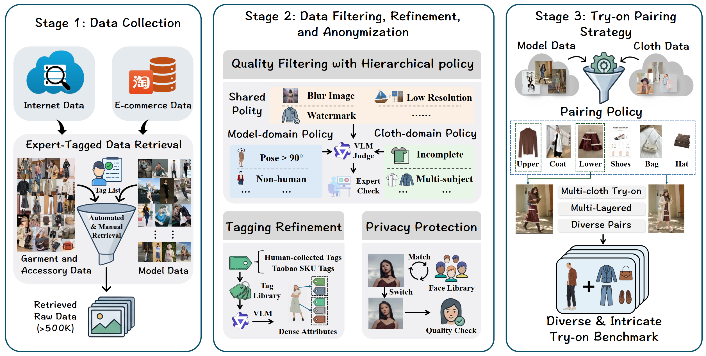
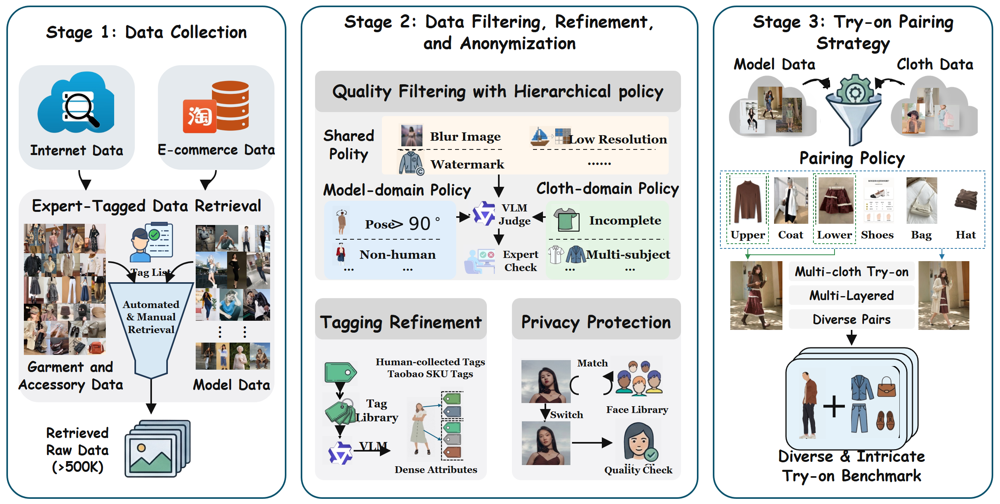

# Virtual Try-on Data Pipeline / 虚拟试衣数据流程

这个案例以图片资产为主。面板、标题、分隔线、流程箭头和普通标签被重建为可编辑对象，服装、人物、截图、图标与缩略图则保留为可替换的原始裁切资产。

This is an asset-heavy reconstruction. Panels, headings, dividers, connectors, and ordinary labels are editable, while garments, people, screenshots, icons, and thumbnails remain replaceable source crops.

## Original / 原图

## Reconstructed preview / 重建预览

## Files / 文件

- [Editable SVG](./editable.svg)
- [Self-contained SVG / 内嵌资产 SVG](./editable_embedded.svg)
- [Native PowerPoint / 原生 PPTX](./editable.pptx)
- [Reconstruction manifest](./manifest.json)
- [Quality report](./quality_report.md)
- [Editability report](./editability_report.md)

The reconstruction contains 52 editable text elements, 52 structural vector elements, 1 editable equation, and 37 source-preserved assets.
